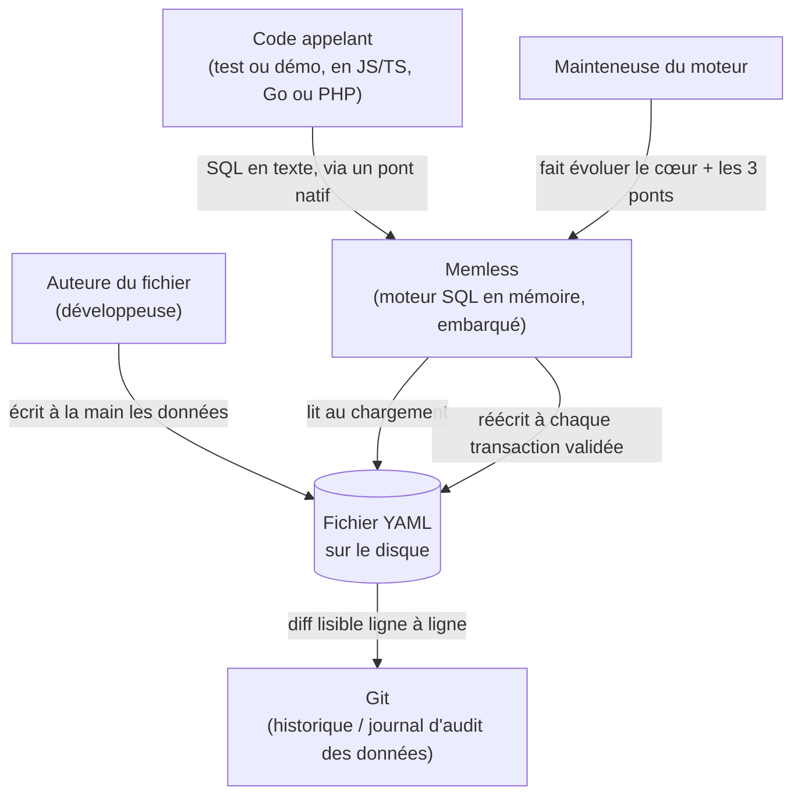
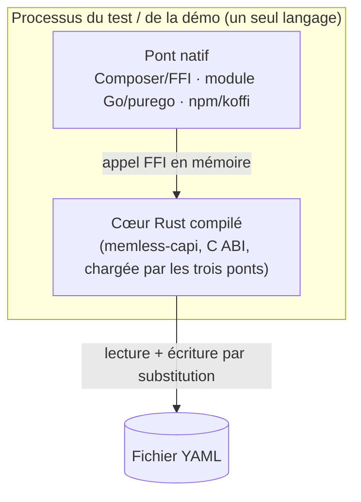
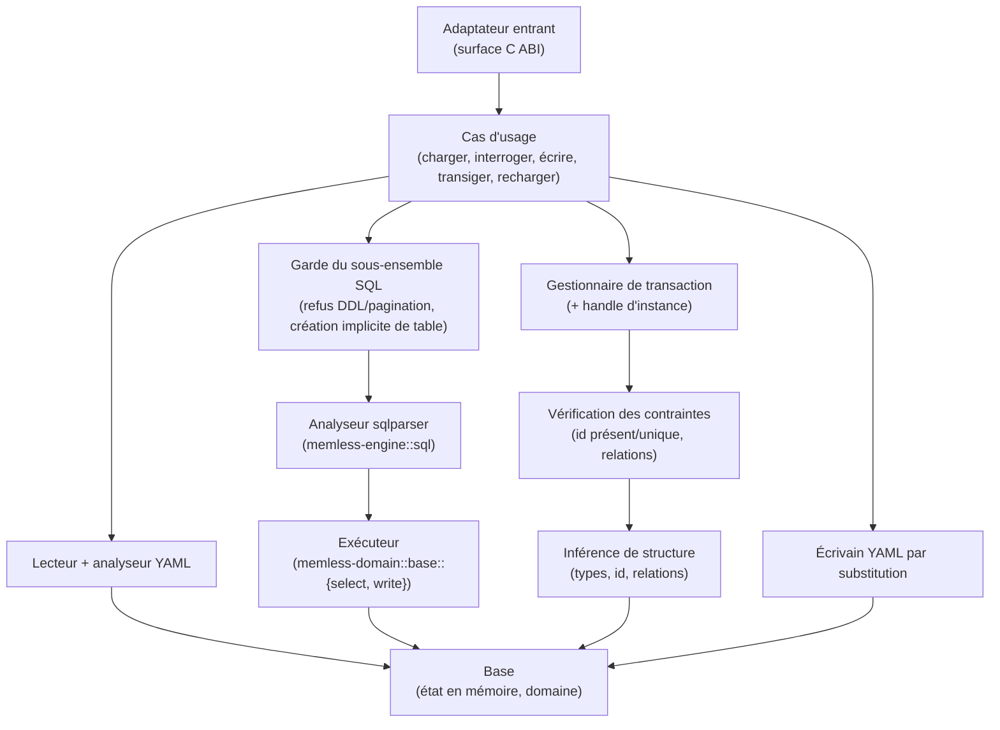

<!-- charpente-navigation -->
**Index** : [Memless — Architecture](../../ARCHITECTURE.md)  
**Suivant** : [§4. Composants](components.md)

*Bloc généré — il se retisse à chaque écriture, ne l'édite pas à la main.*
<!-- /charpente-navigation -->

## §3. Diagrammes

Les vues suivent le modèle C4 — comme les niveaux de zoom d'une carte, du pays à la rue. Elles
décrivent l'architecture **constatée sur le code**.

### 3.1 Contexte (C4 Context)



Memless n'écoute aucun port et ne parle à aucun système distant : le seul « extérieur » est le
fichier sur le disque et, indirectement, Git qui suit ce fichier (§9.1 du brief).

### 3.2 Conteneurs (C4 Container)

Tout vit **dans le processus du code appelant** — il n'y a pas de conteneur déployable séparé. Le
**cœur** est compilé une fois et partagé ; il est exposé par une seule surface native mince —
`memless-capi` (C ABI) — que les trois ponts chargent, Node par `koffi` (FFI dynamique) plutôt que par
un addon compilé.



### 3.3 Composants (C4 Component, dans memless-capi)



### 3.4 Flux critique — écriture validée puis réécriture par substitution

C'est le flux le plus délicat : un changement accepté doit atteindre le disque **entièrement ou pas
du tout** (décisions 5, 17, 18 du brief).

```mermaid
sequenceDiagram
    participant A as Code appelant
    participant U as Cas d'usage (Commit)
    participant I as Contraintes + inférence
    participant Y as Écrivain YAML
    participant D as Disque

    A->>U: commit()
    U->>I: redériver la structure sur l'état proposé
    alt une contrainte est violée (id dupliqué, relation cassée)
        I-->>U: refus nommant la règle, la table, la ligne
        U-->>A: erreur ; état en mémoire inchangé
    else état final valide
        I-->>U: ok
        U->>Y: sérialiser tout l'état (ordre stable)
        Y->>D: écrire un temporaire dans le même répertoire, puis fsync
        alt écriture disque échoue (espace, chemin)
            Y->>D: supprimer le temporaire
            Y-->>U: échec d'écriture
            U-->>A: erreur ; changement annulé aussi en mémoire (décision 18 du brief)
        else écriture réussie
            Y->>D: rename sur le fichier d'origine, puis fsync du répertoire
            Y-->>U: ok
            U-->>A: succès
        end
    end
```

Une transaction validée qui ne change rien ne déclenche aucune réécriture (décision 19 du brief). Le
temporaire porte un nom réservé et distinctif ; une transaction échouée le supprime elle-même, et un
temporaire laissé par un arrêt brutal n'est jamais touché au chargement — l'écriture suivante le
remplace par le sien, sans jamais le confondre avec le fichier réel (§8.6 du brief, décision 17 du
brief).

### 3.5 Flux critique — refus d'une relation cassée dans une transaction

```mermaid
sequenceDiagram
    participant A as Code appelant
    participant U as Cas d'usage (Écrire)
    participant S as Base (état de travail)
    participant I as Vérification des contraintes

    A->>U: begin()
    A->>U: DELETE FROM users WHERE id = '01H7B3'
    U->>S: appliquer dans la transaction ouverte (état intermédiaire toléré)
    A->>U: commit()
    U->>I: redériver ; wallets.user_id pointe-t-il encore vers une ligne réelle ?
    I-->>U: refus : relation wallets → users cassée
    U-->>A: erreur nommant les deux tables ; aucune étape n'atteint le disque
```

L'état intermédiaire d'une transaction ouverte peut sembler transitoirement invalide ; seul l'état à
la validation compte (décision 15 du brief). **Les deux ordres passent** dans une même transaction —
supprimer d'abord l'utilisateur puis le portefeuille, ou l'inverse ; ce qui est refusé à la validation,
c'est de supprimer l'utilisateur en **laissant** le portefeuille qui le référence.

### 3.6 Flux critique — charger et valider

Le chargement est tout-ou-rien : un fichier incohérent ne produit **aucun** état partiel (§8.1, §8.2,
§13 du brief).

```mermaid
sequenceDiagram
    participant A as Code appelant
    participant U as Cas d'usage (Charger / Recharger)
    participant Y as Chargeur YAML
    participant N as Inférence
    participant I as Vérification des contraintes
    participant S as État en mémoire

    A->>U: load(chemin) ou reload()
    U->>Y: lire + parser le fichier
    alt YAML invalide, vide, sans table, valeur imbriquée
        Y-->>U: refus nommant le cas
        U-->>A: erreur ; aucun état chargé (reload : l'état précédent reste intact)
    else YAML lu
        Y->>N: deviner types, id, relations
        N->>I: id présent et unique ? relations vers des lignes réelles ?
        alt une contrainte est violée
            I-->>U: refus nommant la règle et la table
            U-->>A: erreur ; aucun état partiel (reload : état précédent intact)
        else cohérent
            I->>S: publier l'état d'un coup
            U-->>A: prêt
        end
    end
```

Un rechargement ne construit le nouvel état qu'après l'avoir validé, puis bascule d'un coup : un
rechargement raté laisse donc l'état précédent intact, jamais remplacé par rien (§8.9 du brief). Un
rechargement est refusé si une transaction est ouverte. `reload()` (`memless_reload`, ABI 5) est un
**verbe natif dédié**, pas du texte SQL : `sqlparser` ne porte aucun verbe « RELOAD », et un
`SELECT`/`execute` qui contiendrait ce mot le refuse comme du SQL invalide, exactement comme
aujourd'hui.
